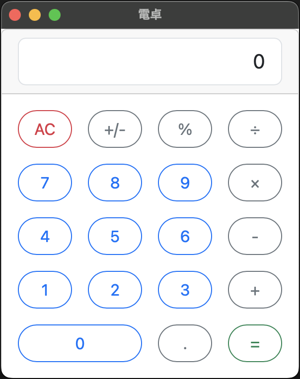

# 電卓

## 開発環境

- [Tauri](https://tauri.app/)

### 使用言語

- [TypeScript](https://www.typescriptlang.org/)
- [Rust](https://www.rust-lang.org/)

※ Rust の独自コード記述はなし

### 使用ライブラリ

- [Bootstrap v5.0](https://getbootstrap.jp/docs/5.0/getting-started/introduction/)
- [bignumber.js](https://mikemcl.github.io/bignumber.js/)

## 実行方法

### Dev

```
$ npm install
$ npm run tauri dev
```

### Build

```
$ npm run tauri build
```

## 使い方

一般的な電卓と同等の機能を備えています

### 四則演算

- 足し算
- 引き算
- 掛け算
- 割り算

### その他の機能

- パーセント
- 小数点
- 符号

### スクリーンショット


